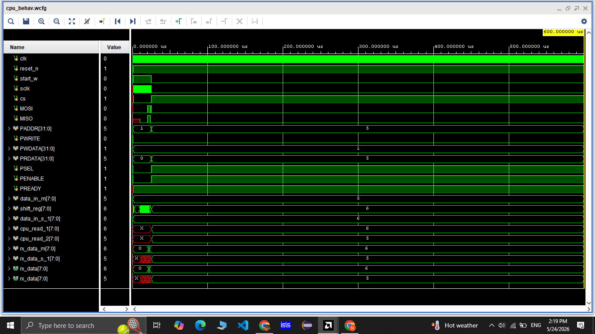

# SPI-Master-Slave-system-with-APB-Interface
# SPI Master-Slave with APB Interface
### SystemVerilog · Xilinx Vivado · Fully Verified in Simulation

---

## What This Project Does

A complete SPI communication system where a CPU controls
data transfer through an APB register interface. The CPU
writes transmit data and a start signal over APB, the SPI
master clocks out the data to the slave, and the CPU reads
back the received bytes from both sides.

---

## System Architecture

```
CPU Testbench  (cpu.sv)
      │
      │  APB Bus (PSEL, PENABLE, PWRITE, PREADY)
      ▼
APB Wrapper    (spi_wrapper.sv)
      │
      ├──► SPI Master  (spi_master.sv)
      │         │  SCLK, CS, MOSI, MISO
      └──► SPI Slave   (slave.sv)
```

---

## Protocol Background

### SPI (Serial Peripheral Interface)
4-wire synchronous serial protocol:

| Signal | Direction    | Purpose                  |
|--------|-------------|--------------------------|
| SCLK   | Master → Slave | Serial clock            |
| CS     | Master → Slave | Chip select (active low) |
| MOSI   | Master → Slave | Master data out          |
| MISO   | Slave → Master | Slave data out           |

This implementation uses **SPI Mode 0**:
- Data shifts out on the falling edge of SCLK
- Data is sampled on the rising edge of SCLK
- MSB transmitted first

### APB (Advanced Peripheral Bus)
Part of ARM AMBA bus family. Low-power bus for slow
peripherals. Transaction sequence:

```
Cycle 1: PSEL=1, PWRITE, PADDR, PWDATA set
Cycle 2: PENABLE=1
Cycle 3: PREADY=1 → transfer complete
```

---

## Register Map

| PADDR | Name       | Access | Description               |
|-------|------------|--------|---------------------------|
| 0x01  | CONTROL    | W      | Bit[0] = start trigger    |
| 0x02  | TX_MASTER  | W      | Master transmit byte      |
| 0x03  | TX_SLAVE   | W      | Slave transmit byte       |
| 0x04  | RX_MASTER  | R      | Master received byte      |
| 0x05  | RX_SLAVE   | R      | Slave received byte       |

---

## SPI Master FSM

Three-state Mealy FSM clocked on system clock:

```
         start=0
        ┌──────┐
        ▼      │          start=1 / cs=0, load tx
  ┌─────────┐  │    ──────────────────────────────►  ┌────────────┐
  │  IDLE   │──┘                                      │  TRANSFER  │
  │ cs=1    │                                         │ shift MOSI │
  │ MOSI=0  │ ◄──────────────────────────────────     │ sample MISO│
  │ sclk=0  │    auto (1 cycle)                  │    └────────────┘
  └─────────┘                                    │          │
                                          ┌──────┘     index==0
                                          │        ▼
                                          │   ┌─────────┐
                                          └── │  DONE   │
                                              │ cs=1    │
                                              │ done=1  │
                                              └─────────┘
```

**TRANSFER state detail:**
- 7-bit counter generates SCLK by toggling every 100
  system clock cycles
- First 5 SCLK half-cycles: warmup (count_sync < 5)
- SCLK falling edge + count_sync ≥ 5: shift MOSI MSB
- SCLK rising edge + count_sync ≥ 5: sample MISO bit
- When index reaches 0: all 8 bits done → DONE state

---

## SPI Slave Phase Diagram

The slave uses a count register to sequence through
three behavioural phases:

```
INIT phase     (posedge sclk, count < 5)
  ├─ index reset to 7
  ├─ count increments each posedge
  ├─ shift_reg loads tx_data (negedge)
  └─ index_checking reset to 0 (negedge)
        │
        │ count reaches 5
        ▼
SAMPLE phase   (posedge sclk, cs=0, count ≥ 5)
  ├─ rx_data[index] = MOSI
  ├─ index decrements
  └─ done_sampling asserts when index = 0
        │
        │ negedge sclk
        ▼
SHIFT phase    (negedge sclk, cs=0, count ≥ 5)
  ├─ MISO = shift_reg[7]
  ├─ shift_reg shifts left
  ├─ index_checking increments
  └─ done_sending asserts when index_checking = 7
        │
        │ done_s (done_sending AND done_sampling)
        └──────────────────────────────► reset count → INIT
```

---

## Signal Ownership Table

Every register has exactly one always block as its owner.
This was the core RTL discipline enforced in this project:

| Signal          | Owner block       | Status |
|-----------------|-------------------|--------|
| count           | posedge sclk      | ✅     |
| index           | posedge sclk      | ✅     |
| done_sampling   | posedge sclk      | ✅     |
| rx_data         | posedge sclk      | ✅     |
| shift_reg       | negedge sclk      | ✅     |
| index_checking  | negedge sclk      | ✅     |
| done_sending    | negedge sclk      | ✅     |
| MISO            | negedge sclk      | ✅     |

---

## Simulation Results

```
Master transmitted : 0x05
Slave received     : 0x05  ✅

Slave transmitted  : 0x06
Master received    : 0x06  ✅
```

APB handshake verified: PSEL, PENABLE, PREADY toggle
correctly. PRDATA returns correct rx values after
transaction completes.


WAVEFORM OF THE SPI-Master-Slave-system-with-APB-Interface



---

## Key RTL Lessons Learned

### 1. Multiple Drivers = Hardware Short Circuit
Two always_ff blocks driving the same register means two
gate networks are physically connected to the same D input
wire of a flip-flop. In real silicon this causes a short
circuit — the gates fight over the wire voltage and the
output is undefined. Simulators sometimes mask this by
picking one driver arbitrarily, which is dangerous.

Fix: one signal = one always block. All conditions become
if/else branches inside that block, which synthesise to a
clean MUX chain feeding a single D input.

### 2. Blocking vs Non-Blocking in always_ff
Blocking assignments (=) inside always_ff execute
sequentially like software, causing race conditions between
parallel always blocks at simulation time. Non-blocking
assignments (<=) evaluate all right-hand sides first, then
apply all updates together at the clock edge — matching
how real flip-flops work.

Rule: always_ff → always use <=

### 3. Iteration Discipline
This slave went through 4 iterations to eliminate all
multiple-driver conflicts. Tracking each signal to its
single owner block is a systematic process, not guesswork.

---

## Files

| File             | Description                          |
|------------------|--------------------------------------|
| spi_master.sv    | SPI master with FSM, clock divider   |
| slave.sv         | SPI slave with phase-based control   |
| spi_wrapper.sv   | APB slave register interface         |
| cpu.sv           | CPU testbench, APB master            |

---

## Tools

- Xilinx Vivado 2024
- SystemVerilog IEEE 1800-2017

---

## Author

NITHISHKUMAR B
B.E/B.Tech — Sri Krishna College of Engineering and Technology 
LinkedIn: 
